# **体外神经元在模拟游戏世界中具象化后，学习并表现出感知能力**

# **In vitro neurons learn and exhibit sentience when embodied in a simulated game-world**

<!--
同学们上午好, 我们小组将为大家呈现的是一篇发表在世界顶级期刊 Neuron 的学术论文, 其标题如 Slides 上所示

这个标题稍微有点抽象, 所以我将要以一张电镜照片为切入点, 为大家介绍这篇论文的主要内容
-->

---

# Intro

生物神经网络 (BNN) 在高密度电极阵列 (HD-MEA) 上被培养

<!-- 
大家现在看到的图片是一个体外神经元集团的电镜照片

这个神经元集团被培养在一块特制的高密度电极阵列上, 成为了一个"盘中之脑"

你可以看见电极照片中, 有许多规则的矩形结构, 这些是就是电极阵列

它来自人体表细胞退分化后, 得到的人源诱导干细胞, 再从人源诱导干细胞诱导分化成了人类神经细胞

所以这是真正由人类神经细胞构成, 有着真正轴突和树突连接的体外神经网络
-->

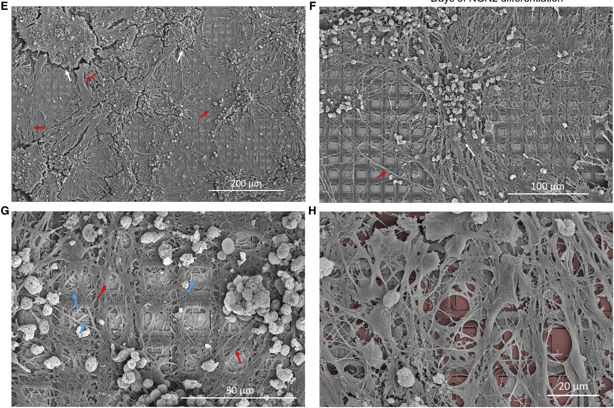

---

# Intro

BNN 与硅基计算机集成在一起, 由硅基计算机控制游戏世界的状态

<!--
从外界看这只是物理容器里的一块神经元组织, 但是对于这块神经元组织来说,它可能产生了自己的意识, 并且认为自己生存在一个截然不同的世界里
-->

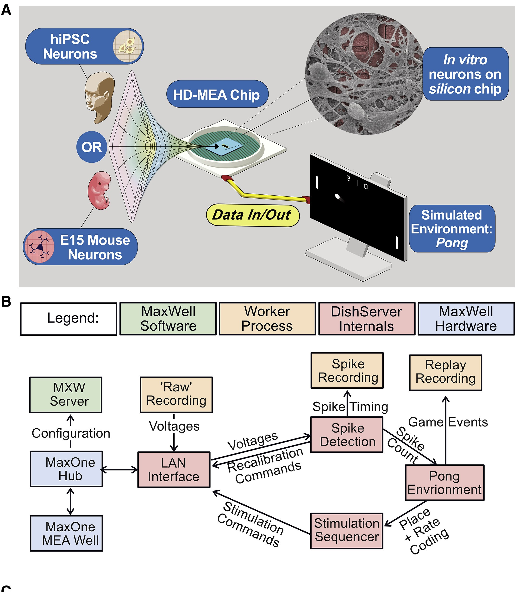

---

# Intro

正在玩游戏的"盘中之脑"

它 5 分钟就学会了游戏规则

<!-- 
而这个世界其实是一个用电信号模拟出来的复古游戏 “乒乓”

这块盘中之脑相信自己就是一个球拍而它活动的全部意义就是把飞过来的乒乓球一次又一次地打回去

这是史上首个成功的体外人工合成生物智能

其整个方法和细节都记载在了我们今天要呈现的论文中

发表这个研究的澳大利亚科学家团队花了八年的时间调教这个"盘中之脑"

而今天我们将用 30 分钟的时间尝试让大家了解这个研究的主要内容
-->

---

# 目录

## 1. 研究背景
## 2. 实验图解
## 3. 实验内容
## 4. 实验结果
## 5. 结果诠释

<!-- 
这是我们此次 Presentation 的总体内容安排

由我来为大家讲解开头的两个部分

由高圣涵同学为大家讲解实验的内容和得到的实验结果

最后由张语晴同学为大家分析这些结果应该被如何看待和解释 
-->

---

# 目录

## **1. 研究背景**
## 2. 实验图解
## 3. 实验内容
## 4. 实验结果
## 5. 结果诠释

---

# 1. 研究背景

## 1.1 研究动机

- 生物计算的优越性被广泛假设

- 生物神经元之外的任何人工电路系统都无法支持至少三阶复杂度

- 对自由能原理进行验证
<!-- 
首先我们来了解一下这篇研究出现的原因

第一点是相对耳熟能详的, 我们的大脑的能耗比是远高于硅基计算机的
并且, 现在的硅基计算机只能进行离散计算, 对于连续计算只能做近似的采样处理, 而一个普遍的推测是大脑的进行的是连续计算

第二点强调的是目前所有的人工电路系统都达不到三阶复杂度, 意味着一些复杂计算也许只有生物神经网络才能完成

[实际上三阶复杂度的意思就是指系统中每一个元件必须包括三个动态的电物理过程, 电物理过程就是原件的电性质随时间的变化]

而最后一点中提到的自由能原理, 则需要我们稍微集中点注意力来理解
-->

---

# 1. 研究背景
## 1.2 自由能原理 (Free Energy Principle)

- 提出者: Karl Friston (2010)
- 自由能原理是一个生物智能的理论框架
- 自由能原理也是一种数学原理

<!--
自由能原理的提出者是著名的神经科学大牛 Karl Friston, 生涯论文引用接近 35 W 次 

而自由能原理是一个尝试解释生物系统的智能行为的理论框架, 也就是关于大脑如何工作的理论

同时他也是一种数学原理, 这意味这自由能原理极其难以证伪, 除非你能完全推翻他的假设, 或者在其理论框架下找到矛盾
-->

---

# 1. 研究背景
## 1.2 自由能原理 (Free Energy Principle)

**基本假设:** 
  - 贝叶斯大脑假说

  - 自组织系统目的是最小化自由能 
    - 最小化系统内部信息熵

<!--
自由能原理的基本假设有两个

一个是贝叶斯大脑假说, 这个假设假定了大脑的认知原则, 就和统计学中的贝叶斯定理是一样的

大脑时刻进行的是贝叶斯推理, 根据先验概率(经验)和新的证据来更新自己的认知 

第二个假设是自组织系统的目的是最小化自由能.

自由能本来是一个热力物理学概念, 但是他本质上就是大脑的预测和现实之间的差距

对于生物智能体来讲, 我们可以从信息论的角度, 理解为大脑会采取措施来最小化系统的内部信息熵
-->

---

# 1. 研究背景
## 1.2 自由能原理 (Free Energy Principle)

**通俗解释:**

- 大脑会区分内部和外部, 并对外部进行贝叶斯推理
- 内部模型对外部世界进行预测
- 大脑的目标是最小化预测误差

<!--
通俗解释就是大脑会区分内部和外部, 并对外部进行贝叶斯推理, 然后建立一个内部的贝叶斯模型, 用来对外部世界进行预测
-->

---

# 目录

## 1. 研究背景
## **2. 实验图解**
## 3. 实验内容
## 4. 实验结果
## 5. 结果诠释

---

# 2. 实验图解

- 记录运动区域的活动
  - BNN 的输出

- 针对感受区域的刺激
  - BNN 对世界的感受
  - 世界对 BNN 行为的反馈

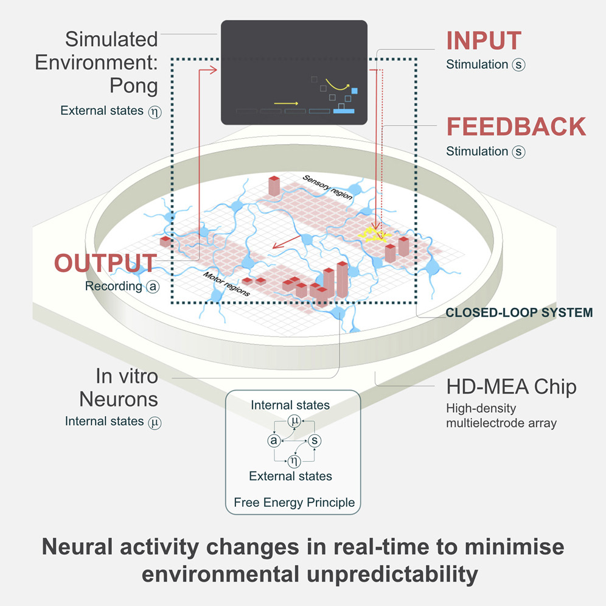

<!-- 这张图片就是这次实验的全貌, 他包含了绝大部分的核心内容

这块盘子中, 就是我们的神经元集团和电极阵列

注意电极阵列有几块红色的区域

而这些区域就是电极阵列和神经元集团进行信息传递的区域

通过下面的两个区域, 电极阵列记录神经元对外界行动的意愿, 到时候计算机直接根据这个数据判断神经元想在虚拟世界中干什么

而上面的区域则是电极阵列给神经元集团提供的感觉刺激, 也就是神经元集团对外界的感知, 
同时也负责让它知道自己的行动会得到世界的什么反馈 -->

---

# 2. 实验图解

"盘中之脑" 系统的数学模型

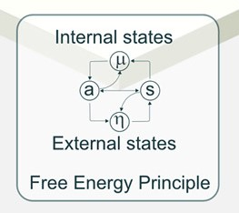

<!-- 而在刚刚图中的中间部分还有一个小区域, 他画了一个这样的图, 或者叫做网路

实际上这就是自由能原理的一个数学抽象表达

本篇实验就是根据这个模型 来设计的.

其中的含义如果有感兴趣的同学, 可以在提问环节提问. -->

---

# 目录

## 1. 研究背景
## 2. 实验图解
## **3. 实验内容**
## 4. 实验结果
## 5. 结果诠释

---

# 3. 实验内容
## 3.1 神经元的培养
- 小鼠皮层细胞（MCCs）
  - 胚胎大鼠提取
- 人体皮层细胞（HCCs）
  - DSI 诱导干细胞分化
  - NGN2 直接重编程

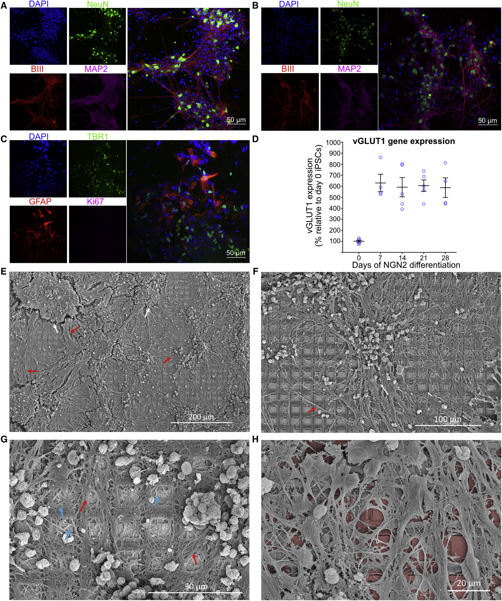

<!-- 
首先，我们来介绍一下实验用到的培养物, 主要为两种: 小鼠皮层细胞（MCCs）和人体皮层细胞（HCCs）

对于小鼠皮层细胞,研究者们从小鼠的大脑皮层中提取了皮层细胞进行培养。

接下来，实验人员使用了两种比较复杂的方法，使其分化成了人类皮层神经元的单层细胞。

在实验中，为了确认这些细胞确实分化成了神经元，研究者们使用泛神经元标记物进行检测.

右边图中的荧光就来自于神经元的标记物

-->

---

# 3. 实验内容
## 3.2 神经网络的形成
- 同步爆发活动
  - 多个神经元几乎同时发放动作电位的现象
- 自发动作电位
  - 无外界刺激时，神经元自发产生的动作电位

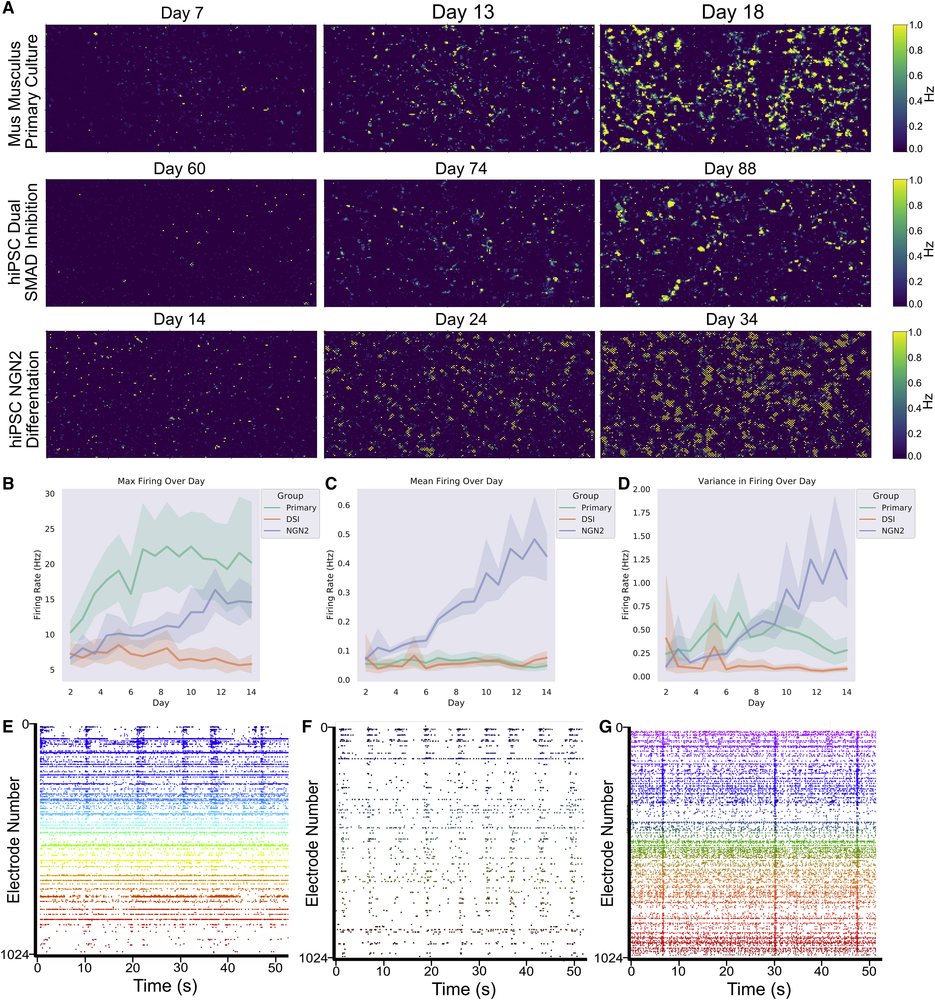

<!-- 
同时实验人员观察了细胞在体外环境中的电生理活动发展情况。

所谓电生理活动，就是指神经元产生的电信号活动，例如电位变化、突触传递等等。

如果细胞在培养过程中逐渐发展出稳定和典型的电生理活动，那么我们就说他达到了电生理成熟。

根据图中数据我们发现，小鼠皮层细胞和人类皮层细胞都在培养一段时间后，会出现规律的同步爆发活动。同步爆发活动顾名思义，就是在特定的时间点，多个神经细胞会同时产生动作电位，形成短暂的同步放电活动，说明他们达到了电生理成熟。
-->

---

# 3. 实验内容

## 3.3 DishBrain 系统

- DishBrain: 一个低延实时的系统
- 用 MEA 记录培养物的电生理活动
- 并通过电刺激提供“感觉”信息

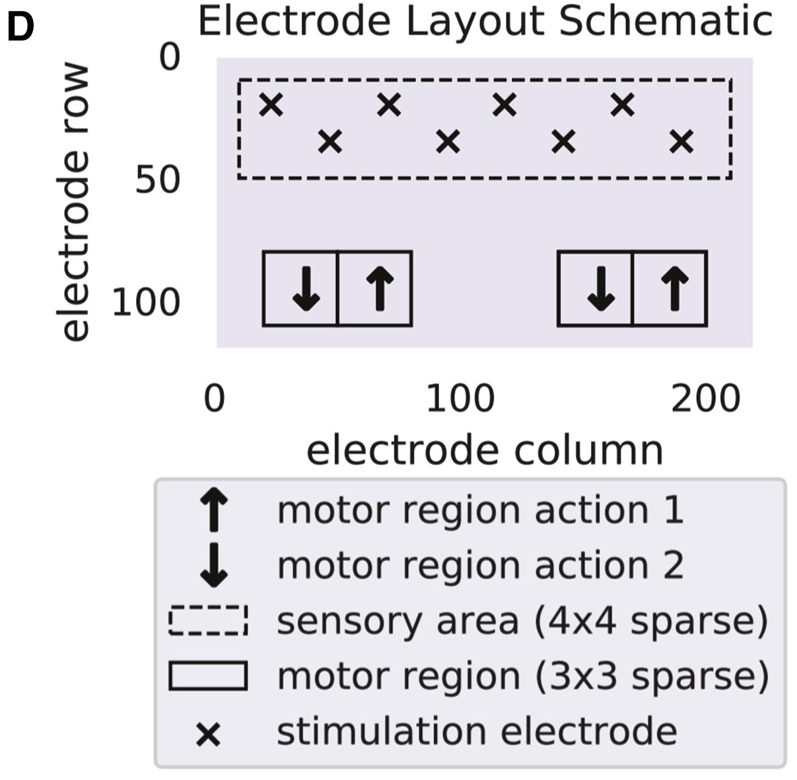

<!-- 之前在引言部分有提到，DishBrain是一个低延迟、实时反馈的系统，可以用MEA记录神经元培养物的电活动，并通过电刺激提供“感觉”信息。

**那具体怎么用 MEA 来实现交互呢？**

**我们看到这张图，图中是多电极阵列的功能划分, 上面的大矩形区域是感觉区域，负责输入感觉刺激和反馈刺激。**

**八个叉号代表八个电极，这八个电极负责输入所有的刺激。**

**小球距离球拍的位置信息被编码成了感觉刺激, 神经元集团通过这个感觉刺激来感知游戏世界。**

**随着球不停运动, 小球距离球拍的位置发生变化, 感觉刺激会不断发生变化，神经元由此得知游戏的运行状态。**

**下面的两个小矩形区域是两个活动区域，统计两个区域的放电尖峰信号读数，不同区域计数的情况就代表神经元想要对外输出的行动, 我们根据这个来控制游戏中球拍移动的方向。**

**每次球拍未接住球时，游戏环境会利用感觉区域输入电刺激作为世界对它的反馈，游戏的一个回合就到此结束。**-->

---

# 3. 实验内容

## 3.4 DishBrain 系统的输入设计

- 感觉输入
  - **位置编码**: 通过**刺激发生的位置信息**来编码
  - **频率编码**: 通过**刺激发生的频率信息**来编码
- 反馈输入
  - **可预测刺激**: 叠加有规律的刺激
  - **不可预测刺激**: 叠加噪声
  - **静默反馈**: 切断感觉刺激
  - **无反馈**: 无任何反馈输入

<!--
刚刚我们提到，感觉刺激编码的是球相对球拍的位置，具体来说就是使用75毫伏的电压刺激八个电极中的其中一个来对位置进行编码。

感觉刺激是输入配置的一种，现在我们来看看更改输入配置会对实验结果有什么影响。

同时另一种刺激类型 反馈刺激，也就是基于结果或者动作向培养物给出反馈的刺激，比如接住球了就会给一个反馈刺激。它分为这四种，分别是可预测或不可预测刺激、静默反馈还有无反馈

注意静默反馈和无反馈的区别在于, 静默反馈会切断感觉刺激, 无反馈则不会切断, 它还是能感知游戏世界，但游戏世界不会给它反馈。

-->

---

# 3. 实验内容

## 3.5 学习效果的观察指标

- **平均对打长度:** 平均一局游戏持续的对打回合数

- **Ace 次数:** 第一个回合就 Miss 的次数

- **长对打次数:** 连续三次 Hit 的次数

<!--
介绍完Dishbrain系统和整个游戏是怎样运作之后，我们来看看实验的具体结果。为了考察bnns的学习效果，研究人员定义了三个指标。

刚刚已经介绍了在乒乓游戏中，一次 miss 将导致游戏重开，所以我们把 hit-miss 的比率定义为平均对打长度，也就是平均对打回合数，而 ace 则是指第一回合就 miss 的一局游戏，长对打是指一局游戏中连续三次 hit 的次数。

可以简单理解为平均对打长度越大，ace 越少，长对打越多, 我们就认为学习效果就越好。
-->

---

# 3. 实验内容

## 3.6 对照组和实验组的设置

- **对照组**
  - CTL: 只有培养基, 没有任何培养物
  - IS: 随机噪声作为输入, 没有任何培养物, 也没有培养基
  - RST: 不发送感觉刺激给培养物, 但是培养物依然能够控制球拍
- **实验组**
  - MCC: 使用小鼠皮层细胞作为培养物, 正常模拟游戏
  - HCC: 使用人类皮层细胞作为培养物, 正常模拟游戏

<!-- 
整个实验中，研究人员设立了多个实验组和对照组，分别是 CTL，IS，RST，MCC和HCC，接下来很多图片里都有他们。

首先CTL是 MEA 上只有培养基, 没有任何培养物的对照组, 用来排除培养基有"智能"的可能；

IS是随机噪声作为输入, 没有任何培养物, 也没有培养基的控制组, 用来排除随机噪声也能产生"智能"的可能；

RST是培养物没有接受到感官信息, 但是依然能够控制球拍的休息对照组，用来排除 培养物的智能和感觉刺激无关的可能；

最后的两个分别是人类皮层细胞和小鼠皮层细胞的实验组。
-->

---

# 目录

## 1. 研究背景
## 2. 实验图解
## 3. 实验内容
## 4. **实验结果**
## 5. 结果诠释

---

# 4. 实验结果
## 4.1 是否存在学习效果

*训练 5 分钟前后的学习效果总比:*

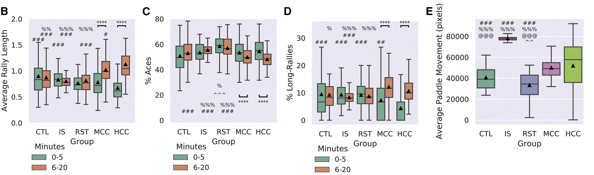

<!-- 
我们可以看到在图 B 到 D 中显示了以 5 分钟为界, 上半场和下半场内分别的三个学习效果指标，也就是平均对打长度，ace数和长对打数

我们可以看到只有MCC和HCC培养物在 5 分钟的前后, 平均对打长度和长对打数显著增加，ace 数有所减少，显示出明显的学习迹象。
-->

---

# 4. 实验结果

## 4.1 是否存在学习效果

*学习效果在时域上的变化:*

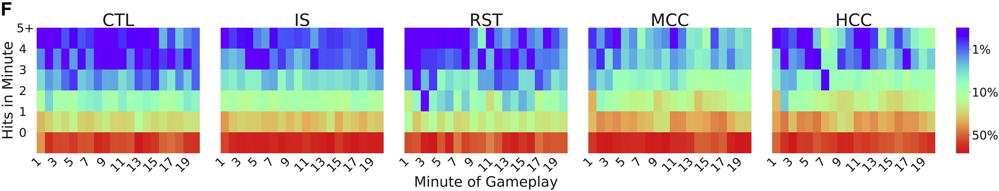
<!-- 
在论文中的一些其他数据显示实验组中存在显著的学习效应，而在对照组中不存在，同时学习能力在老鼠和人类细胞之间存在些许差异。  
-->

---

# 4. 实验结果

## 4.2 学习效果和感知信息密度的关系

>- 感觉输入
>   - **位置编码**: 通过**刺激发生的位置信息**来编码
>   - **频率编码**: 通过**刺激发生的频率信息**来编码

<!-- 
前面提到过, 感觉输入的编码方式有两种, 一种是位置编码, 一种是频率编码.

但是两者实际上都可以被独立地用来编码感觉信息, 所以我们就可以控制感觉信息的密度, 来观察神经元的学习效果会不会有什么变化 。
-->
---

# 4. 实验结果

## 4.2 学习效果和感知信息密度的关系

进行了实验的三种信息密度:
1. 只使用**位置编码**
2. 使用 **EXP3 算法**
4. 同时**使用位置**和**频率编码**

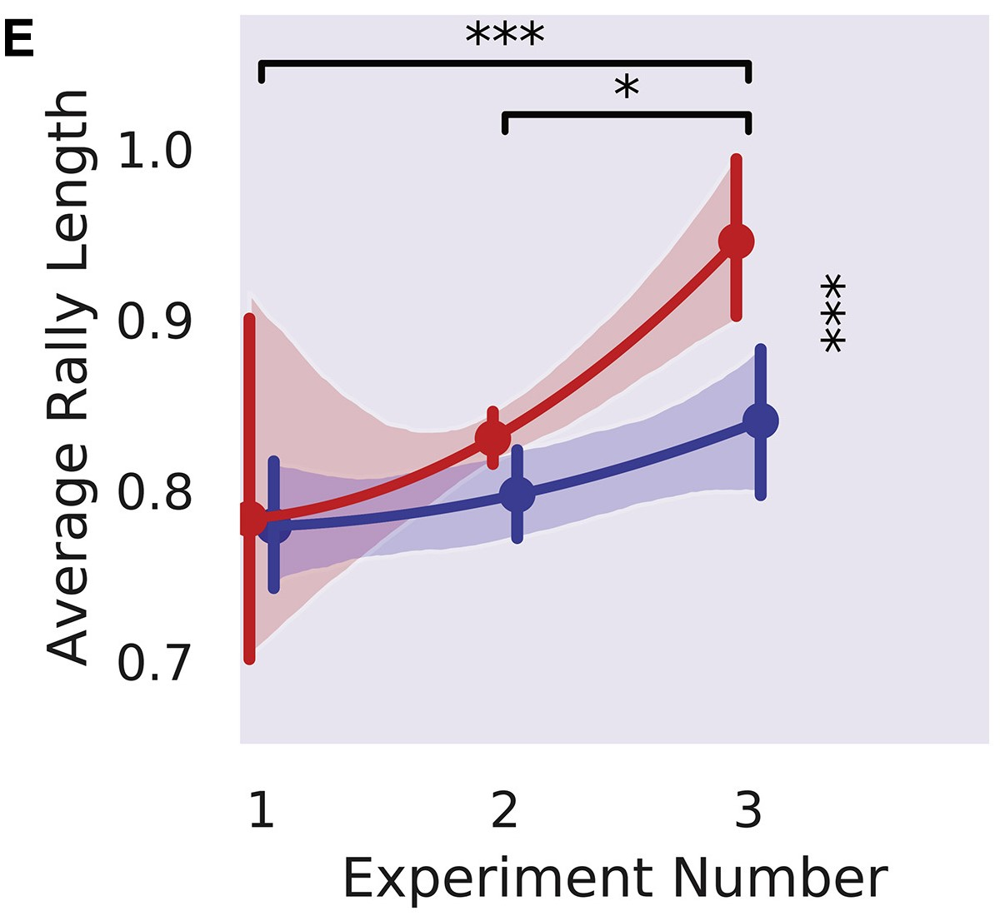

<!-- 
在三次实验中，我们分别预设了不同的输入配置，

分别是仅对位置编码、

对运动区域的活动赋予权重，

还有就是结合频率和位置编码来作为输入，

可以简单理解为这三种配置对应的感官信息输入密度是不断增加的。

图E展示了每种培养类型在最后十五分钟的游戏表现，我们可以看到在从 实验1 到 实验3 平均对打长度有了显著增加。

这暗示我们增加感官信息输入密度和神经元的学习效果呈正相关，也就是说，增加感知信息密度可以使神经元的游戏表现更好。
-->

---

# 4. 实验结果

## 4.3 学习效果和反馈方法的关系

> - 反馈输入
>   - **可预测刺激**: 叠加有规律的刺激
>   - **不可预测刺激**: 叠加噪声
>   - **静默反馈**: 切断感觉刺激
>   - **无反馈**: 无任何反馈输入

<!-- 
前面同样提到过, 反馈输入也有四种

为了研究这四种反馈刺激对神经元学习的效果，我们同样进行了三种不同反馈刺激条件下的模拟测试，
-->

---

# 4. 实验结果

## 4.3 学习效果和反馈方法的关系

*三种反馈的方法:*

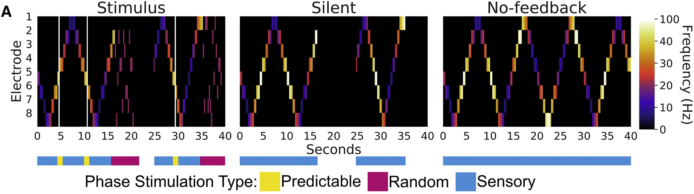

<!--
条件1是在培养物 Hit 或 Miss 时分别施加可预测和不可预测的刺激；

条件2是把条件一中的惩罚换成同样长度的无刺激时间，时间结束后游戏重新开始，也就是中间这张图；

条件3是不基于结果给出任何反馈，也就是在 Miss 时不重新开始而是继续游戏。当球拍未成功拦截球时，球会弹起继续移动而不中断；但仍提供报告球位置的感觉刺激。
-->

---

# 4. 实验结果

## 4.3 学习效果和反馈方法的关系

三种反馈方法对应的学习效果如右图所示

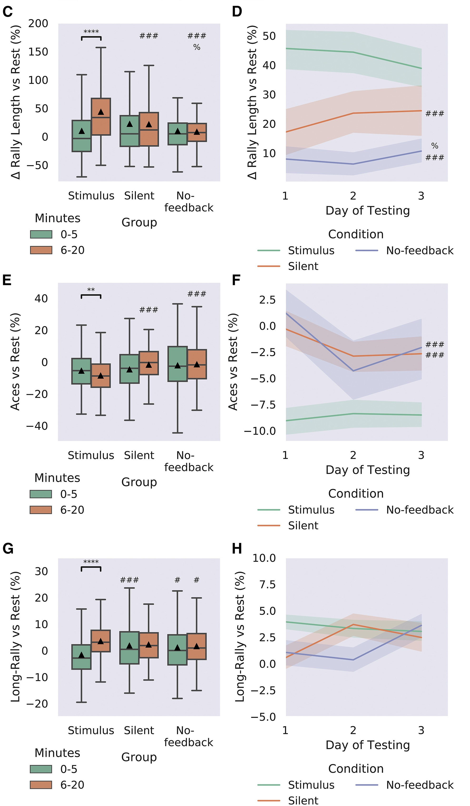

<!--
接下来这几张图显示了实验结果。左边一列显示了随游戏时间增加，有反馈刺激的 也就是第一张图，明显每分钟击球次数更多，而静默刺激较少，无刺激最少，和RST对照组类似。

中间这一列图则显示了刚刚提到的三个指标在游戏中的结果，也就是平均对打长度，aces数和长对打数，结果显然也是符合预期的，有反馈刺激的实验组中的神经元在经过一段时间的学习后平均对打长度显著增加，数量明显高于静默反馈和无反馈的实验组，而无反馈组的结果要更小于静默反馈的结果。

另外两个指标也符合预期。也就是说，反馈刺激对于神经元的学习效果是很重要的，仅仅有感官信息刺激是不够的，学习需要一个反馈来形成闭环系统。

右边一列的图则显示了经过了连续三天的实验，三种指标的变化情况。可以看到三天间三个实验组的同一指标没有显著变化，且三个实验组间同一指标的差异依然存在，并且和中间一列的实验结果是符合的。也就是说，神经元存在自适应行为，符合我们最初的自由能原理的假设。
-->

---

# 目录

## 1. 研究背景
## 2. 实验图解
## 3. 实验内容
## 4. 实验结果
## 5. **结果诠释**

---

# 5. 结果诠释

## 5.1 BNN learns to avoid uncertainty: 验证自由能原理

信息熵
- 衡量信息量和信息的不确定度

- 本研究中使用信息熵作为 BNNs 内部自由能的指标

<!--
通过检测到动作电位的二元分布计算，我们将得到的神经元响应的信息熵作为衡量BNNs内部自由能VFE的指标。

在噪声（也就是不可预测反馈）之后，信息熵会增加，反映出“惊异”的状态。而在正确接到球，收获可预测的反馈后，信息熵会降低。文章预测，最终系统内部的信息熵会降低。

这很容易理解。随着不断地学习，按照贝叶斯原理，先验概率被不断更新，逐渐越来越接近真实的概率，信息的不确定度也就逐渐降低。而不可预测的反馈与根据先验概率得到的预测之间的差距，在原文被称为“surprise”惊异。这样的惊异代表着高信息熵和高自由能。 
-->

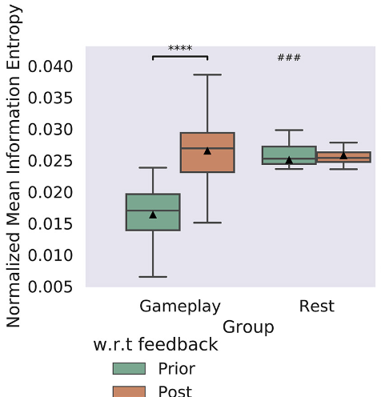

<!-- 
实验结果如图所示。gameplay中，未接到球的神经元经历了不可预测反馈，信息熵显著增加。此外，游戏过程中的平均信息熵低于休息时的信息熵。这也验证了之前的猜想。

简而言之，如理论预测的，游戏过程在与环境进行可预测交互时，减少了信息熵，而在游戏过程中，不可预测的反馈则增加了信息熵。
-->

---

# 5. 结果诠释

## 5.1 BNN learns to avoid uncertainty: 验证自由能原理

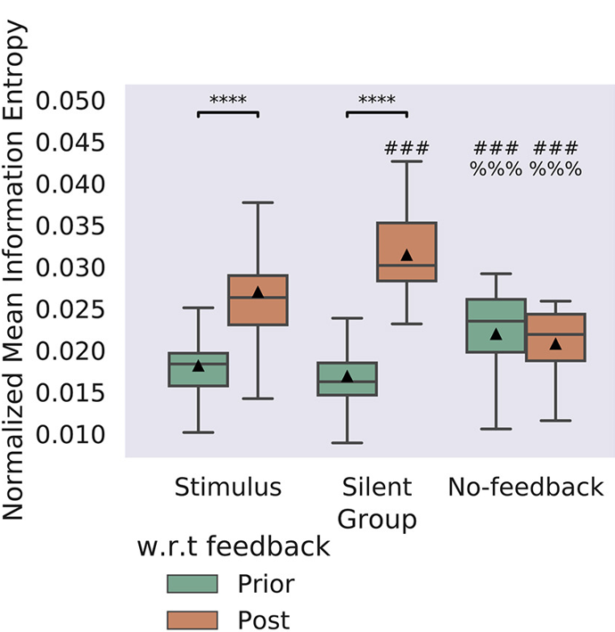

- 结果越不可预测，观察到的学习效果越大
- 需要学习动机（刺激）

<!-- 
在标准刺激条件下，标准化平均信息熵上升。有趣的是，在静默条件下，神经培养物的标准化平均信息熵甚至比刺激条件在反馈后更高。

这可能是因为，静默反馈中更多的失误导致更多不可预测的结果，因为每次失误后球重新开始并其随后的运动是不可预测的。

这与我们的结果一致，即结果越不可预测，观察到的学习效果越大: 因为BNN通过学习避免不确定性。

另一方面，在无反馈条件下，相对于应用反馈时期，标准化平均信息熵没有变化，而在反馈后期有显著较低的得分。这是因为无反馈条件本质上不提供学习机会。

这支持了一个观点，即单纯的感觉刺激是不足以推动学习的：必须有一种 影响感受刺激的学习行为 的动机，这个动机对应着该实验中的刺激反馈。

总而言之，BNN会自发地朝 减少自身接收到的刺激的不确定性 的方向进行自我训练。
-->

---

# 5. 结果诠释

## 5.2 HCCs 的优势

HCCs 的平均回合长度显著长于 MCCs 培养物（表S2）

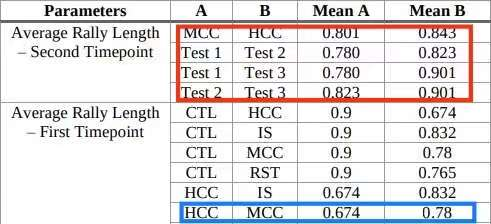

<!-- 
观察到蓝框中，在T1时HCC组表现明显比MCC、CTL和IS组差。这表明HCC在初始体验环境时表现不佳，这可能是因为HCC对paddle的初始不适应控制，或者可能是一种探索性行为。而在红框中T2时，这一趋势发生了逆转：HCC组比MCC组表现更好。

提供了 支持人类神经元比啮齿类神经元具有更优信息处理能力的假设的 实证证据
-->

---

# 5. 结果诠释

## 5.3 研究局限性

**硬件限制** :
  - 刺激电极过少
  - 输入精度限制
  - 检测精度限制

**神经元数量和结构限制**: 
  - 单层皮层神经元
  - $10^6$ MCCs each MEA
  - $10^6$ HCCs each MEA
  - 人类的大脑皮层包含**约160亿神经元**

<!-- 
MEA的电极阵列基于CMOS技术，能够从1024个通道进行记录，理论上可以从32个电极进行刺激，但实际上由于空间限制和控制需求，只能从 8 个独立控制的电极进行输入刺激。

输入的感觉刺激过于粗糙, 比简单的生物还要粗糙

这意味着在实时状态下无法区分对神经元体或树突域的刺激，这两种情况都可能被刺激。

在实时状态下无法从不同的神经元结构中分离出处理电变化，例如无法区分来自细胞体或树突的动作电位。

实验中神经元的数量远小于真实的人类大脑中的神经元数量，且神经元架构相对简单，即使与具有三维大脑结构的微小生物相比，可用的连接数量非常有限。
-->

---

# 5. 结果诠释

## 5.3 研究局限性

**神经元类型限制**: 
  - 皮质细胞无长期记忆
  - MCCs 和 HCCs 都迅速丢失训练效果 

**自由能原理**:
  - 用最小化熵（即自由能）作为自适应行为的解释可能过于简单

   <!-- 该实验采用的最小化熵的模型可能过于简化，不足以充分解释神经网络的自适应和自主学习行为。故研究人员认为该实验的结果并不具有决定性，还需未来更多针对BNN的模型的探索。-->

---
# 5. 结果诠释
## 5.4 前景

- 新的体外智能研究范式
  - 训练方法
  - 神经元培养物的选择
  - 自由能的衡量方法

<!-- 作为历史开创性的实验, 他提供了一种基于生物计算机而非硅基计算机的训练方法, 这些方法为未来的体外智能研究提供了新的范式, 为未来的研究提供了指向标.

此外，在未来，或许能通过改变神经元培养物的选择，例如添加具有长期记忆能力的细胞与目前本实验中使用的短期记忆的皮层细胞共同使用，得到同时具有长期记忆和短期记忆的生物神经网络。-->

- 远超硅基计算机的智能
  - 系统复杂性
  - 连续计算能力

<!-- 前面讲到本次实验中的神经元数量远小于真实的人类大脑中的神经元数量，且神经元架构相对简单
但是在克服这些困难后, 单位体积内的神经元数量就能迅速增加后, 它的智能很可能就会有比这次实验中还要惊人的变现

而其可能存在的连续计算能力, 也是当下硅基计算机完全无法比拟的 -->

- 超大规模集成计算
  - 低功耗
  - Robust (不易损)

<!-- 低功耗意味着同样的能耗上限下, 能够集成比现有算力更多的神经元集团

Robust 就是说生物神经网络的稳定性, 耐用性, 恢复性都比硅基计算机要好

这意味着更少的维护成本 -->

